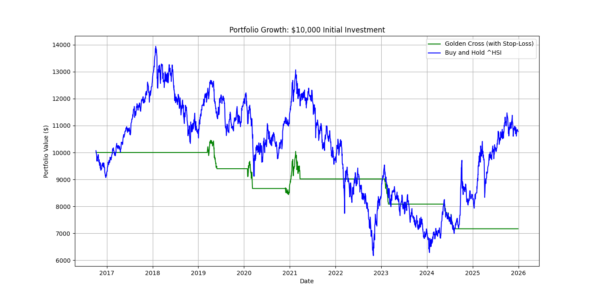

# golden_cross_backtest
Golden Cross backtest on Hang Seng Index

# Golden Cross Backtest Project

## Overview
Backtest of the Golden Cross strategy (50/200-day SMA crossover with 10% trailing stop-loss) on Hang Seng Index (^HSI) from 2016-2025.

## Theory
Golden Cross: Buy when 50-day SMA > 200-day (uptrend). Sell on reverse or stop-loss. Aims to capture trends, reduce losses.

## Structure
- `data/`: Raw prices.
- `src/`: Code (fetcher, strategy, backtester, analytics).
- `results/`: Plots, metrics CSV.
- `test_strategy.py`: Test script.

## Installation/Run
1. Clone repo.
2. `python -m venv env; env\Scripts\activate; pip install -r requirements.txt`
3. `python main.py` — fetches data, runs backtest, outputs plots/CSV.

## Key Results
- Equity Curve: Strategy safer than buy-hold.

- Metrics:
[Paste your table here or embed CSV]

## Conclusions
Strategy underperformed returns (-28%) vs buy-hold (+8%), but lower risk (vol 6% vs 22%, drawdown -31% vs -56%). Good for risk-averse; improve with looser stops.

